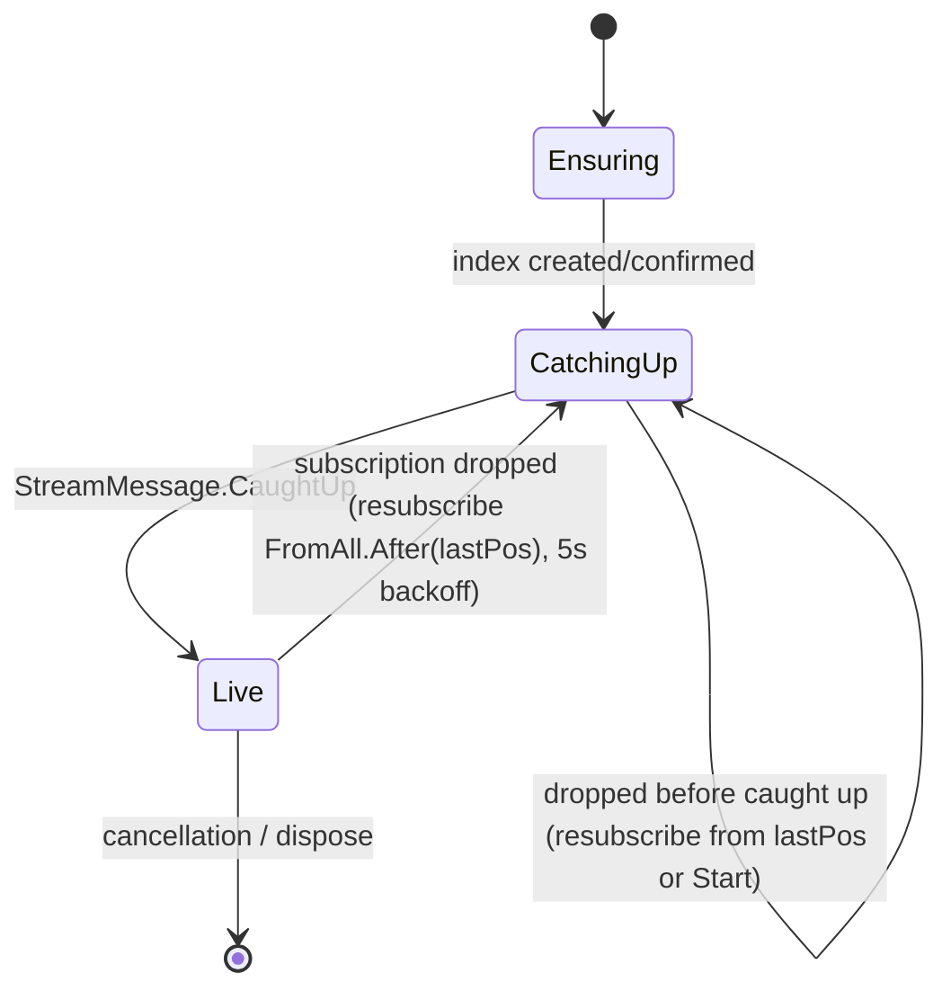

# Design: Index-backed merge streams for MicroPlumberd read models

Branch: `feature/mp-index-backed-merge-feasibility`. This is the implementation design that turns the CONFIRMED
feasibility (`feasibility-index-backed-merge-streams.md` §7, empirical spike `LiveIndexSubscriptionSpikes.cs`)
into shippable code. Every capability claim below traces to a spike result (cited as `SPIKE-n`) or is called out
as a **NEW empirical question** the engineer must close before the slice that depends on it merges.

## Overview

Give a read model the option to source its merged stream from a **KurrentDB 26.1 user-defined index**
(`$idx-user-<name>`, read via filtered `$all`) instead of a `fromStreams([$et-…]).linkTo(outputStream)` join
projection. This is an **opt-in, additive** path: the projection-backed default is unchanged, both paths share
the same subscription loop / dispatch / error-backoff, and only handlers that explicitly ask for it move.

**The confirmed dividing line (evidence-locked):** index-backing works for **CATCH-UP consumers**
(client-checkpointed, `$all`-`Position`) and NOT for **PERSISTENT-subscription consumers** — the KurrentDB
persistent-subscription pipeline does not resolve `$idx-user-*` links at all (SPIKE-7, clean four-way control,
partitions included). This split holds for BOTH merge shapes; it is cleaner than a shape-A/shape-B split.

**v1 scope (this design, what the engineer builds now):** **shape-A only** — event-type/stream merges (the
`[EventHandler]` default), catch-up, **opt-in**, projection-backed stays the default. v1 slices are S1–S4.

**v2 / fast-follow (proven-feasible, deferred — NOT built in v1):** **shape-B** per-key lookups
(`ProcessManagerClient`-style, keyed by a body field) via a **field-partitioned** index read by per-key prefix
`$idx-user-<name>:<value>`. Empirically confirmed (SPIKE-8 read PASS, SPIKE-11 subscribe PASS — per-key partition
pushes ONLY that key's events, catch-up and live, isolated). SPIKE-4's earlier "impossible" was an accessor bug
(`rec.data`/`rec.body` vs the correct `rec.value`). Fully specced in the "V2 / fast-follow" section so it can be
picked up later; the owner scoped it out of v1.

## Goals / non-goals

**Goals (v1)**
- An opt-in index-backed merge source for catch-up `[EventHandler]` read models (shape A), with the SAME
  ordering, no-loss and no-double-process guarantees the projection path gives today.
- Zero change to existing apps: the default stays projection-backed; opting in is a per-handler choice.
- One subscription loop (no fork of `SubscriptionRunner`), extensible to the v2 shape-B per-key source.
- A **create-new-and-swap** filter-change lifecycle (the `mp_query_hash` equivalent) with DELETE-based orphan
  cleanup — in-place index redefine is empirically impossible (SPIKE-5: HTTP 409; also FUTURE work per KurrentDB
  26.1 docs), so this is the settled, permanent lifecycle. Kept behind an `IIndexDefinitionReconciler` seam so an
  in-place strategy can drop in IF/when KurrentDB ships index-definition updates — future-proofing, not built now.
- A loud guard against the `SubscribeToStream("$idx-user-…")` silent-zero-delivery footgun (SPIKE-2a).

**Non-goals** (explicit — do not implement in v1)
- **Persistent-subscription consumers** (`SubscribeEventHandlerPersistently`, e.g. `ProcessManagerClient`
  Inbox/Outbox) — stay on projections, **permanently** (SPIKE-7; the ONE permanent exclusion, both shapes). A
  persistent index-subscription state is explicitly NOT designed; the registration guard rejecting
  `UserDefinedIndex + persistently` is a permanent rule.
- **Shape-B per-key lookups** (field-partitioned index) — **deferred to v2 / fast-follow**, not built in v1.
  Proven feasible (SPIKE-8/11); fully specced in the "V2 / fast-follow" section so it is ready to pick up. Owner
  scope call, not a capability gap.
- **Snapshot handlers** (`SubscribeStateEventHandler`) index-backed — deferred; same mechanism can extend to
  them later, not in this design.
- **Changing the default.** Projection-backed remains the default merge source.
- **Migrating existing projection-backed read models' data.** Opt-in creates a fresh index for opted-in
  handlers only; existing projections/streams are untouched. Offline data migration of merges already exists
  (`MicroPlumberd.Migration/UserDefinedIndexCopyContext`) and is out of scope here.
- **Specific-revision start positions** on an index-backed handler (only `Start`/`End` are meaningful on
  filtered `$all`).

## Architecture

### Components

| Component | Assembly | Responsibility |
|-----------|----------|----------------|
| `UserDefinedIndex` (relocated primitives) | `MicroPlumberd` (core) | Create/ensure an index (`EnsureAsync`), name normalisation + filter build, index-stream name, HTTP endpoint parsing. The reusable subset of today's `UserDefinedIndexSource`. |
| `ISubscriptionState` | `MicroPlumberd` (core) | Abstraction the runner loop consumes: `Subscribe()` → `StreamSubscriptionResult`, `Advance(ResolvedEvent)` → update resume position. Two implementations. |
| `StreamSubscriptionState` | `MicroPlumberd` (core) | Existing behaviour, refactored behind `ISubscriptionState`: `SubscribeToStream(outputStream, FromStream)`, resume `FromStream.After(OriginalEventNumber)`. |
| `IndexSubscriptionState` | `MicroPlumberd` (core) | NEW: `SubscribeToAll(FromAll, resolveLinkTos:true, StreamFilter.Prefix($idx-user-<name>))`, resume `FromAll.After(OriginalPosition)`. |
| `SubscriptionRunner` (loop) | `MicroPlumberd` (core) | Unchanged control flow; now drives `ISubscriptionState` — one loop, both sources. |
| `PlumberEngine.SubscribeEventHandlerViaIndex<T>` | `MicroPlumberd` (core) | NEW sibling of `SubscribeEventHandler<T>`: ensure index (not projection) → subscribe via `IndexSubscriptionState` → same handler dispatch. |
| `EventHandlerStarter<T>` (+ `MergeSource`) | `MicroPlumberd.Services` | Carries the opt-in choice; `Start()` routes to projection or index entry point. |
| `AddEventHandler<T>(… mergeSource)` | `MicroPlumberd.Services` | Registration surface for opt-in. |
| `UserDefinedIndexSource` (offline reader) | `MicroPlumberd.Migration` | UNCHANGED public behaviour; refactored to delegate its create/ensure/name/filter to core `UserDefinedIndex` (no duplication). |

### Assembly layering (load-bearing decision)

Today `UserDefinedIndexSource`, `UserDefinedIndexSpec`, `KurrentHttpEndpoint` live in **`MicroPlumberd.Migration`**,
which is DOWNSTREAM of core. The live subscription path lives in core `MicroPlumberd` (`PlumberEngine`,
`SubscriptionRunner`) and `MicroPlumberd.Services` (starters). Core **cannot** reference Migration.

Decision (**APPROVED by team-lead**): **relocate the index-lifecycle primitives into core** as
`UserDefinedIndex` — specifically
`EnsureAsync`, `NormalizeName`, `BuildFilter`, `EscapeJsString`, `IndexStream`/prefix const, `IndexNameFor`
(the hash-suffixed name), and `KurrentHttpEndpoint`. Migration's `UserDefinedIndexSource` keeps its
offline-only members (`CountMatchingAsync`, `WaitUntilReadyAsync` count-convergence gate, `ReadAsync`,
`CreateWaitReadAsync`) and calls the relocated core primitives for create/name/filter. This obeys "NEVER
DUPLICATE" (CLAUDE.md) — one implementation of index creation — and keeps the dependency arrow pointing the
right way (Migration → core). The relocation is behavior-preserving and is guarded by the existing Migration
integration tests (parity assertion in S1).

Rationale for NOT copying: two divergent index-creation code paths (one in core, one in Migration) would drift
on filter/name rules and re-introduce the exact cross-repo hazards the workspace forbids.

### Why the loop is shared, not forked

`KurrentDBClient.SubscribeToStream(...)` and `KurrentDBClient.SubscribeToAll(...)` **both return
`StreamSubscriptionResult`** (verified against `KurrentDB.Client` 1.x), whose `.Messages` is an
`IAsyncEnumerable<StreamMessage>` carrying `StreamMessage.Event(ResolvedEvent)` and `StreamMessage.CaughtUp`.
So the only per-source differences are (1) which subscribe call is made and (2) how the resume position is
computed from a delivered `ResolvedEvent`. Both are hidden behind `ISubscriptionState`; the loop body in
`SubscriptionRunner.WithHandler` — dispatch via `OnEvent`, `ICaughtUpHandler.CaughtUp()`, the 5s
resubscribe-with-backoff, `FailFastException` handling — is unchanged and literally reused. This satisfies the
directive "reuse `SubscriptionRunner`/`ICaughtUpHandler`/error-backoff — don't fork the subscription loop", and
is the Open/Closed way to add a source (`docs/standards/dotnet.md`).

```csharp
// core: the seam that lets one loop serve both sources
interface ISubscriptionState : IDisposable
{
    string StreamName { get; }                       // for logs; "$idx-user-<name>" in the index case
    CancellationToken CancellationToken { get; }
    KurrentDBClient.StreamSubscriptionResult Subscribe();  // SubscribeToStream OR filtered SubscribeToAll
    void Advance(ResolvedEvent e);                   // FromStream.After(rev) OR FromAll.After(pos)
}
```

`SubscriptionRunner.WithHandler` changes only these two lines:
```csharp
await using var sub = subscription.Subscribe();       // was: state-specific
// … on StreamMessage.Event(e):
await OnEvent(func, e, model);
subscription.Advance(e);                              // was: subscription.Position = FromStream.After(e.OriginalEventNumber)
```

### Process flow — index-backed catch-up subscription (steady state)

```mermaid
sequenceDiagram
    participant App as EventHandlerService (boot)
    participant St as EventHandlerStarter<T>
    participant PE as PlumberEngine
    participant UDI as UserDefinedIndex
    participant KDB as KurrentDB 26.1
    participant SR as SubscriptionRunner
    participant RM as Read model (IEventHandler)

    App->>St: Start()
    St->>PE: SubscribeEventHandlerViaIndex<T>(start)
    PE->>UDI: EnsureAsync(name=IndexNameFor(out,filter), types)
    UDI->>KDB: POST /v2/indexes/<name> {filter,start:true}  (idempotent; 409 = reuse)
    PE->>SR: run IndexSubscriptionState(FromAll.Start, StreamFilter.Prefix($idx-user-<name>))
    SR->>KDB: SubscribeToAll(FromAll.Start, resolveLinkTos:true, filter)
    KDB-->>SR: history links (commit order)  [SPIKE-2b]
    loop each ResolvedEvent
        SR->>RM: Handle(metadata, ev)
        SR->>SR: Advance → FromAll.After(e.OriginalPosition)  [SPIKE-3]
    end
    KDB-->>SR: StreamMessage.CaughtUp  → RM.CaughtUp() (if ICaughtUpHandler)
    Note over KDB,SR: live tail: new matching appends pushed in commit order [SPIKE-1, SPIKE-2b]
```

### State — subscription lifecycle



Invariants:
- **Resume position is `$all Position`, in-memory only.** Held on `IndexSubscriptionState.Position` (a `FromAll`).
  Advanced after each successfully-dispatched event to `FromAll.After(e.OriginalPosition!.Value)` (SPIKE-3). On
  drop, resubscribe from the last advanced position → no re-processing of already-dispatched events, no gap.
- **No persisted checkpoint store exists to break.** The catch-up path in this repo never persists a checkpoint
  across process restarts (`SubscriptionRunnerState.Position` is an in-memory field; boot starts from the
  configured `start`). The index path mirrors this exactly. So the "checkpoint type changes from `StreamPosition`
  to `Position`" (feasibility §4) is confined to the in-memory resume field — **there is no on-disk format
  migration.** This de-risks binding constraint #2.
- **Boot start mapping:** `FromStream.Start → FromAll.Start`, `FromStream.End → FromAll.End`. A specific-revision
  start is rejected at registration (`OPEN`/guard below), because it has no meaning on filtered `$all`.

### Filter-change lifecycle — create-new-and-swap (the `mp_query_hash` equivalent) — RESOLVED

SPIKE-5 settled the mechanism (evidence folded in; feasibility risk #4 closed):
- **In-place redefine is impossible** — POSTing a different filter to an existing index name returns **HTTP 409**;
  `GET` confirms the stored filter never silently changes. So the projection-style `disable→update→enable` has no
  index equivalent; a filter change MUST create a new index.
- **DELETE works** — `DELETE /v2/indexes/<name>` returns **200**, so the superseded index can be retired.
- **Cost** — delete + recreate + full backfill of 10k matched events ≈ **3.7s**; backfill scales with the number
  of matched events (see risk R2 — a real cost for high-volume event types).

Design — one confirmed strategy today, behind a seam so a future in-place strategy can drop in:

```csharp
// core: idempotent "ensure the current index exists and return the name to subscribe to".
interface IIndexDefinitionReconciler
{
    Task<string> ReconcileAsync(string outputStream, IReadOnlySet<string> eventTypes, CancellationToken ct);
}

// THE settled, permanent default — in-place redefine is impossible today (SPIKE-5/409; KurrentDB 26.1 docs list
// "Updating an index definition" as FUTURE work). Filter-hashed name + create-new + DELETE-based cleanup.
sealed class CreateNewAndSwapReconciler : IIndexDefinitionReconciler { … }

// NOT built now — a placeholder for IF/when KurrentDB ships index-definition updates. Do not implement until
// then; it CANNOT work on 26.1 (a redefine POST is 409-rejected). Documented so the seam's intent is explicit.
// sealed class InPlaceUpdateReconciler : IIndexDefinitionReconciler { … }  // future — not viable on 26.1
```

The seam is future-proofing only; `CreateNewAndSwapReconciler` is the sole registered implementation. Swapping to
in-place later is a one-line DI change gated on a KurrentDB feature that does not yet exist.

- **Index name embeds the filter hash.** `IndexNameFor(outputStream, filter)` =
  `mpidx-<normalized-output>-<hash8-of-filter>` where `hash8` = first 8 hex of `SHA-256(BuildFilter(types))`
  (ordinal-sorted ⇒ stable for a set). Today's `IndexNameFor` hashes the output-stream name; this design changes
  the hash INPUT to the **filter**, so a changed event-type set deterministically yields a NEW name.
- **Swap on change.** `ReconcileAsync` computes the current name; `EnsureAsync` creates it if new (KurrentDB
  backfills, ~3.7s/10k) or reuses it (409 = definition unchanged, no rebuild). The subscription targets the
  current-hash index and, for a newly-created one, reads from `FromAll.Start` — the read model **rebuilds** from
  the new merged view (same observable effect as a projection `disable→update→enable`).
- **Orphan cleanup (DELETE-based).** After the new index is ready and the subscription has cut over,
  `ReconcileAsync` deletes any `mpidx-<normalized-output>-*` index whose hash suffix ≠ the current one
  (`DELETE /v2/indexes/<name>` → 200). Multi-instance caveat: in a multi-instance deployment, delete only after
  all instances are on the new definition (a rolling deploy transiently keeps both) — for a single-instance app
  (the norm here) boot-time cleanup is safe. Correctness never depends on cleanup running: an un-deleted orphan
  is harmless (extra storage + counts toward the ~60-index headroom, R3).
- **No-op when unchanged.** Same type set ⇒ same name ⇒ 409 reuse ⇒ nothing created, deleted, or rebuilt.

### Guard against the SubscribeToStream footgun (binding constraint #1)

`SubscribeToStream("$idx-user-<name>", …)` silently delivers ZERO events (SPIKE-2a), and `ReadStream` on the
index stream is equally non-functional — SPIKE-9 confirmed this **exhaustively**: the index stream is reachable
ONLY through filtered `$all`, never as a direct stream. To make this fail LOUD instead of hanging silently, both
`StreamSubscriptionState.Subscribe()` and any direct index `ReadStream` helper assert their stream name does
**not** start with `UserDefinedIndex.IndexStreamPrefixRoot` (`"$idx-user-"`) and throw `InvalidOperationException`
pointing at this doc and at the filtered-`$all` reader. Index streams are ONLY ever read via filtered
`SubscribeToAll` / `ReadAllAsync` + `StreamFilter.Prefix`. Startup/contract assertion, not a hot-path cost.

**Optimal recipe (standardized — use verbatim).** Live catch-up subscription:
`client.SubscribeToAll(FromAll.Start, resolveLinkTos: true, new SubscriptionFilterOptions(StreamFilter.Prefix("$idx-user-<name>")))`;
checkpoint = `ResolvedEvent.OriginalPosition`; resume = `FromAll.After(pos)`. Bounded read: the same
`StreamFilter.Prefix` via `ReadAllAsync`. Per-key (shape B): prefix `"$idx-user-<name>:<key>"`.

## V2 / fast-follow — shape-B field-partitioned per-key lookup (PROVEN-FEASIBLE, deferred)

> **NOT part of v1.** The owner scoped v1 to shape-A. This section is a proven-feasible spec (SPIKE-8 read PASS,
> SPIKE-11 subscribe PASS) so v2 can pick it up without re-discovery. It is index-backable for **catch-up**
> consumers only (the persistent exclusion below applies here too).

`EnsureLookupProjection` today fans a `$ce-<category>` stream out into one stream per key via
`linkTo('<cat>-' + e.body.<Key>, e)`. SPIKE-8/11 show a KurrentDB 26.1 **field-partitioned index** reproduces
this for catch-up consumers.

**Scalability (corrects the earlier proliferation concern):** shape-B needs **ONE field-keyed index per lookup
category — NOT one index per key value.** KurrentDB fans that single index out into per-value partition streams
(`$idx-user-<name>:<value>`) itself. So a lookup over N distinct keys is ONE index, not N — no unbounded
index proliferation. (Field config allows max 1 field/index, which is exactly one routing property — matches
`EnsureLookupProjection`'s single-key design.)

Index definition (adds a `fields` selector to the shape-A create; note the body accessor is `rec.value`, NOT
`rec.data`/`rec.body` — the SPIKE-4 bug):
```
POST /v2/indexes/<name>
{ "filter": "rec => rec.schema.name == 'X'",
  "fields": [ { "name": "recipientid", "selector": "rec => rec.value.RecipientId", "type": "INDEX_FIELD_TYPE_STRING" } ],
  "start": true }
```

Per-key read/subscribe — the key is a **prefix suffix** on the index read stream:
```csharp
// bounded per-key read (the Rehydrate analog):
var filter = StreamFilter.Prefix($"$idx-user-{name}:{key}");
client.ReadAllAsync(Direction.Forwards, Position.Start, filter, resolveLinkTos: true);   // only this key's events, commit order
// live per-key catch-up (if a consumer wants live rather than one-shot):
client.SubscribeToAll(FromAll.Start, resolveLinkTos: true, new SubscriptionFilterOptions(StreamFilter.Prefix($"$idx-user-{name}:{key}")));
```
SPIKE-8 (PASS): the prefix read yields ONLY that key's events in commit order, and live-appends tail into the
right partition. So per-key routing maps onto a field-partitioned index + a `:<key>`-prefixed filtered-`$all`
read — for **catch-up** consumers.

v2 work items: `UserDefinedIndex` gains an optional `fields` parameter on create; `UserDefinedIndexSource` gains
`ReadPartitionAsync(name, key)` (bounded, the `Rehydrate` analog) plus, if needed, an `IndexSubscriptionState`
constructed with a `:<key>` prefix (live). Everything else — filter-hashed name, create-new-and-swap, the
`SubscribeToStream`/`ReadStream` guard — carries over unchanged.

**v2 design-open (do NOT block v1):** `EnsureLookupProjection` sources from `$ce-<category>` (every event in a
stream category), whereas every PROVEN index filter is event-type-based (`rec.schema.name == …`). The
`$ce`-category filter form for an index is **UNTESTED**. Replicating category semantics likely means enumerating
the category's known event types as an OR-predicate — which works if the type set is closed but silently misses a
type added later without updating the list. v2 must resolve this (test the category filter form, or accept the
enumerated-types approach with a guard). v1 is `$et` event-type merges and is unaffected.

#### Definitive `ProcessManagerClient` determination (from the code)

`ProcessManagerClient.SubscribeProcessManager` (`MicroPlumberd.Services.ProcessManager/ProcessManagerClient.cs`)
has **two distinct consumption paths**, and they resolve OPPOSITELY:

| Concern | Code | Consumption | Index-backable? |
|---------|------|-------------|-----------------|
| Inbox / Outbox **merge** (shape A) | lines 103–104: `SubscribeEventHandlerPersistently(sender, "…Outbox")` / `(executor, "…Inbox")` | **PERSISTENT** subscription | **NO — permanent** (SPIKE-7). Stays projection-backed. |
| `{PM}Lookup` **per-key lookup** (shape B) | line 107 `EnsureLookupProjection(…, "RecipientId", "…Lookup")`; consumed in `GetManager` line 129 `_plumber.Rehydrate(lookup, "…Lookup-{recipientId}")` | **bounded catch-up READ** (`Rehydrate` = `ReadStream`), NOT a subscription | **YES — via field partitions** (SPIKE-8), because it is a catch-up read. |

So the concrete answer (architect-traced, matches the code): the PM **merge** stays on projections (persistent,
permanent); the PM **lookup** is a catch-up `Rehydrate` read → an index-backing candidate for v2. The one required
rewire is the read itself — `Rehydrate` reads `ReadStream("{PM}Lookup-{recipientId}")`, and
`ReadStream`/`SubscribeToStream` on an index stream is **definitively non-functional** (SPIKE-9), so the lookup
read must become a filtered-`$all` prefix read of `$idx-user-<name>:{recipientId}`. That app-level rewire of
`GetManager`/`Rehydrate` is a v2 item and is optional — the PM lookup keeps working on its projection until
migrated.

### Persistent-subscription consumers: permanently excluded (SPIKE-7, RESOLVED)

Persistent-subscription consumers — e.g. `ProcessManagerClient`'s Inbox/Outbox merge above — **cannot be
index-backed, permanently.** KurrentDB limitation, not a usage bug (SPIKE-7, real KurrentDB 26.1, with controls):

- A persistent group over `StreamFilter.Prefix("$idx-user-<name>")` delivers **ZERO** on catch-up AND live —
  `resolveLinkTos` both **true and false**; a persistent `CreateToStream` directly on `$idx-user-<name>` also **0**.
- **Control A** (persistent filtered-`$all` over a normal `EventTypeFilter`) delivered **3/3** → harness sound,
  the zero is real. The catch-up `SubscribeToAll`+filter path DOES resolve the links (**5/5**) — the persistent
  pipeline simply does not resolve `$idx-user-*` links.

Consequences: the `mergeSource: UserDefinedIndex` + `persistently: true` registration guard is a **permanent
rule**; **no persistent index-subscription state is designed or built**; the `ISubscriptionState` seam has one
family only — catch-up (`StreamSubscriptionState`, `IndexSubscriptionState`).

## APIs / Protocols

### Registration (opt-in)

```csharp
public enum MergeSource { Projection = 0, UserDefinedIndex = 1 }   // default = Projection (safe)

// New overload / optional parameter on the existing registration surface:
services.AddEventHandler<FooReadModel>(mergeSource: MergeSource.UserDefinedIndex);

// Unchanged default — still projection-backed, nothing about existing apps changes:
services.AddEventHandler<FooReadModel>();
```

Registration-time guards (fail fast, `docs/standards/dotnet.md`):
- `mergeSource: UserDefinedIndex` + `persistently: true` ⇒ `throw InvalidOperationException`
  ("index-backed merge supports catch-up subscriptions only; persistent subscriptions stay projection-backed").
- `mergeSource: UserDefinedIndex` + a specific-revision `start` ⇒ `throw` ("only Start/End are valid on an
  index-backed handler").

### `PlumberEngine` entry point

```csharp
public async Task<IAsyncDisposable> SubscribeEventHandlerViaIndex<TEventHandler>(
    TEventHandler? eh = null,
    string? outputStream = null,               // convention-derived if null (same as projection path)
    FromRelativeStreamPosition? start = null,  // Start (default) or End only
    CancellationToken token = default)
    where TEventHandler : class, IEventHandler, ITypeRegister;
```

Behaviour: derive `outputStream` via `Conventions.OutputStreamModelConvention`; derive the event-type set via
`_typeHandlerRegisters.GetEventNamesFor<TEventHandler>()`; `name = await reconciler.ReconcileAsync(outputStream,
types, token)` (`UserDefinedIndexReconciler` ensures the current filter-hashed index exists — create-new-and-swap
+ DELETE cleanup on change, no-op when unchanged — and returns the name to target); then subscribe through an
`IndexSubscriptionState` over `$idx-user-<name>` wired into a `SubscriptionRunner` with the same
`WithHandler`/converter used by `SubscribeEventHandler<T>`. Catch-up only.

### Index HTTP contract (reused verbatim from `UserDefinedIndexSource`)

Create (idempotent; 409 = reuse):
```
POST /v2/indexes/<name>
{ "filter": "rec => rec.schema.name == \"FooCreated\" || rec.schema.name == \"FooUpdated\"", "start": true }
```
Read stream: `$idx-user-<name>`, consumed ONLY via `SubscribeToAll(FromAll, resolveLinkTos:true,
StreamFilter.Prefix("$idx-user-<name>"))`.

## Dependencies

| Dependency | Purpose | Failure handling |
|------------|---------|------------------|
| KurrentDB 26.1 user-defined indexes (`/v2/indexes`, `$idx-user-*`) | The merge source | Create is idempotent (409 reuse). If the node predates 26.1 the POST fails → `EnsureAsync` throws with the failing URI logged; the handler fails to start (loud), it does not silently fall back to a projection. |
| `KurrentDBClient.SubscribeToAll` + `StreamFilter.Prefix` | Live catch-up→tail delivery | Same `catch (Exception) → 5s resubscribe` as the stream path; resubscribe from the in-memory `FromAll` position (no gap/dup). `FailFastException` still bubbles to shut the app down. |
| `UserDefinedIndex` (relocated to core) | One index-lifecycle implementation shared by live + offline paths | Behavior-preserving relocation; Migration parity test (S1) guards it. |
| `MicroPlumberd.Testing` `EventStoreServer` (Docker, KurrentDB 26.1) | Integration test substrate | Per workspace rule, NEVER Testcontainers; each test gets an isolated in-memory server. |

## Vertical-slice implementation plan

Each slice is independently buildable (`dotnet.exe build src/MicroPlumberd.sln`) and ends with a green
integration test against a **real KurrentDB 26.1** via `MicroPlumberd.Testing` (`EventStoreServer.StartInDocker`).
Commit at each slice boundary (`docs/standards/dev-process.md`; team-lead owns git).

### S1 — Index-backed subscription primitive (core)
Relocate `UserDefinedIndex` primitives into core + refactor Migration to delegate; add `ISubscriptionState`,
`StreamSubscriptionState` (behaviour-preserving), `IndexSubscriptionState` (filtered `SubscribeToAll`,
`FromAll` resume); refactor `SubscriptionRunner.WithHandler` to drive `ISubscriptionState`; add the
`$idx-user-` `SubscribeToStream` guard.

Integration tests:
- **S1-T1 (catch-up→live parity with the spike, through the framework abstraction):** create an index over
  types A,B; run `IndexSubscriptionState` inside a `SubscriptionRunner`; assert history `0,1,2` then live-append
  `3,4` arrive in commit order — the SPIKE-2b guarantee, now exercised through production types.
- **S1-T2 (resume):** record position after `0,1,2`, dispose, append `3,4`, resubscribe from the recorded
  `FromAll` position; assert only `3,4` delivered (SPIKE-3).
- **S1-T3 (footgun guard):** `StreamSubscriptionState.Subscribe()` on a `$idx-user-…` name throws
  `InvalidOperationException` (never a silent zero-delivery).
- **S1-T4 (no regression):** existing stream-backed `SubscriptionRunner` path still delivers in order
  (control — the refactor changed the seam, not the behaviour).
- **S1-T5 (Migration parity):** existing `UserDefinedIndexSource` offline read still passes after delegating to
  core `UserDefinedIndex` (guards the relocation).

### S2 — Opt-in wiring on one read model + projection parity
Add `MergeSource` to `EventHandlerStarter<T>.Configure` + `AddEventHandler<T>(mergeSource:)`; add
`PlumberEngine.SubscribeEventHandlerViaIndex<T>`; registration guards.

Integration tests:
- **S2-T1 (the load-bearing correctness test — parity):** register the SAME `[EventHandler]` read model twice
  in one app against real KurrentDB — once `MergeSource.Projection`, once `MergeSource.UserDefinedIndex` — feed
  an identical interleaved event stream, assert both read models reach **identical state** and observed the
  **same delivery order**. This is the concrete form of "exactly the ordering + no-loss + no-double-process the
  projection path gives today."
- **S2-T2 (live after boot):** with the index-backed handler running, append new matching events post-boot;
  assert they are delivered live in commit order (SPIKE-1/2b end-to-end).
- **S2-T3 (`ICaughtUpHandler`):** an index-backed handler implementing `ICaughtUpHandler` receives `CaughtUp()`
  after history — regression-guards `OPEN-4` (PASS).
- **S2-T4 (guards):** `UserDefinedIndex + persistently` and `UserDefinedIndex + revision-start` throw at
  registration.

### S3 — Create-new-and-swap on definition change (lifecycle RESOLVED by SPIKE-5)
`UserDefinedIndexReconciler.ReconcileAsync`: filter-hashed name (`mpidx-<out>-<hash8-of-filter>`), create-new +
`FromAll.Start` rebuild on change, DELETE-based orphan cleanup after cut-over. No strategy seam (in-place ruled
out, SPIKE-5/409).

Integration tests:
- **S3-T1 (definition change → correct merged view):** boot handler v1 (types {A}); feed events; boot v2 (types
  {A,B}); assert a new `mpidx-…-<newhash>` index exists, the read model now includes B events, and there is no
  double-processing within a run.
- **S3-T2 (no-op when unchanged):** re-boot with the same type set ⇒ same name, 409 reuse, no rebuild, no delete.
- **S3-T3 (orphan cleanup):** after a swap, assert the old-hash `mpidx-…-<oldhash>` index is DELETEd (200) and
  only the current-hash index remains; a read from the deleted index no longer resolves.

### S4 — Coexistence + persistent guard + proliferation
Confirm the default, the permanent persistent exclusion, and the ceiling headroom.

Integration tests:
- **S4-T1 (coexistence):** one projection-backed and one index-backed handler in the same app boot both build
  correct read models — the two mechanisms run side by side.
- **S4-T2 (default unchanged):** a handler registered with no `mergeSource` creates a join projection and no
  index (assert `$idx-user-*` absent for it).
- **S4-T3 (persistent stays on projections):** `ProcessManagerClient`'s Inbox/Outbox
  (`SubscribeEventHandlerPersistently`) is unchanged and never index-backed; the `UserDefinedIndex + persistently`
  registration guard throws (permanent rule, SPIKE-7).
- **S4-T4 (ceiling headroom — OPEN-2 resolved):** SPIKE-6 already confirmed 60 indexes/node with no degradation
  (3× today's count). Regression guard, not a gate — assert N index-backed handlers in one app all build
  correctly; re-measure a hard ceiling only if the live count approaches ~60.

### S5 — Shape-B: field-partitioned per-key lookup (catch-up)
`UserDefinedIndex` create gains an optional `fields` selector (`rec => rec.value.<field>`);
`UserDefinedIndexSource` gains `ReadPartitionAsync(name, key)` (bounded, the `Rehydrate` analog) via
`StreamFilter.Prefix("$idx-user-<name>:<key>")`, and an optional live per-key `IndexSubscriptionState`. Optional
app-level migration of `ProcessManagerClient.GetManager`/`Rehydrate` from `ReadStream("{PM}Lookup-{id}")` to the
prefix read (the PM lookup is a catch-up read, so eligible; the PM Inbox/Outbox merge stays on projections).

Integration tests:
- **S5-T1 (partition read):** append interleaved events for keys x,y; a field-partitioned index; assert the
  `:<x>` prefix read yields ONLY x's events in commit order (SPIKE-8).
- **S5-T2 (partition live tail):** with a `:<x>` prefix subscription open, append a new x event post-subscription;
  assert it tails into the x partition, in order.
- **S5-T3 (rec.value accessor):** a field selector over `rec.value.<field>` indexes the partition; a `rec.data`/
  `rec.body` selector indexes nothing — documents the SPIKE-4 accessor bug so it never regresses.
- **S5-T4 (guard on index-stream read):** `ReadStream`/`SubscribeToStream` on a `$idx-user-<name>:<key>` name
  throws (SPIKE-9); the partition is reachable only via filtered `$all`.

## Correctness guarantees (mapped from projection path to index path)

| Property | Projection path (today) | Index path (this design) | Evidence |
|----------|-------------------------|--------------------------|----------|
| Commit ordering | Output-stream link order == commit order | Filtered-`$all` link order == commit order, incl. live appends | SPIKE-1, SPIKE-2b |
| Catch-up → live handoff | `SubscribeToStream` history then tail; `StreamMessage.CaughtUp` | `SubscribeToAll`+filter history then tail; `StreamMessage.CaughtUp` fires at the exact history→live boundary, driving `ICaughtUpHandler` | SPIKE-2b + OPEN-4 (PASS) |
| No loss / no double-process on drop | resubscribe `FromStream.After(rev)` | resubscribe `FromAll.After(pos)` | SPIKE-3 |
| Restart resume | in-memory position; boot from configured start | identical, in-memory `FromAll`; boot from Start/End | design + SPIKE-3 |
| Definition change | `mp_query_hash` disable→update→enable, read model replays | filter-hashed name ⇒ new index (in-place impossible), read model rebuilds, old index DELETEd | SPIKE-5 (409 in-place / 200 DELETE / ~3.7s per 10k) |

## Risk register

| # | Risk | Bite | Mitigation / status |
|---|------|------|---------------------|
| R1 | Silent zero-delivery via `SubscribeToStream("$idx-user-…")` | A future implementer "simplifies" the index path to a stream subscribe → silent hang | Loud guard in `StreamSubscriptionState.Subscribe()` + this doc + S1-T3. SPIKE-2a. |
| R2 | Every event-type-set change triggers a FULL re-backfill (in-place redefine impossible, SPIKE-5/409) | Real latency/cost for high-volume event types — ~3.7s/10k matched events, grows with matched count; the read model is rebuilding meanwhile | Inherent to the confirmed lifecycle. Mitigate by making event-type-set changes rare (they already are — a code change), and by keeping the read model available on the OLD index until the new one is caught up (cut over only after catch-up). DELETE-based cleanup keeps orphan count bounded. |
| R3 | Index count ceiling — headroom confirmed at 60, hard ceiling still unmeasured | Naive 1:1 index-per-read-model (20 today, growing) + transient orphans during swaps | SPIKE-6: 60 indexes created in ~1.3s, 0 rejections, no early/late degradation under concurrent backfill — comfortable at 3× today's count. Hard ceiling not probed; opt-in + DELETE cleanup keep the live count near the read-model count. Re-measure only if count approaches ~60. |
| R4 | `StreamMessage.CaughtUp` on filtered `$all` — RESOLVED | — | OPEN-4 PASS: fires at the exact history→live boundary; `ICaughtUpHandler` works. Regression-guarded in S2-T3. |
| R5 | Two parallel merge mechanisms increase ops surface | Debugging/observability | Accepted as the price of a non-breaking opt-in; log which source each handler uses at start (proper-logging standard). Revisit if index-backed ever becomes default. |
| R6 | Relocating `UserDefinedIndex` to core regresses the offline migration path | Migration behaviour drift | Layering APPROVED by team-lead (Migration→core arrow correct). Behavior-preserving relocation guarded by S1-T5 parity test. |
| R7 | Offline count-convergence readiness gate misapplied to a LIVE, growing store | `WaitUntilReadyAsync(expectedCount)` would hang forever live | RESOLVED — OPEN-6 PASS: the live path subscribes to filtered `$all` immediately after `EnsureAsync` and tails, NO count gate. The offline gate is used only by the Migration bounded read. |

## Empirical questions — ALL RESOLVED (evidence folded into the design)

Nothing is left open; the design is fully evidenced.

- **OPEN-1 / risk #4 — filter-change lifecycle + DELETE — RESOLVED.** In-place redefine impossible (SPIKE-5: 409,
  `GET` confirms no silent change; KurrentDB 26.1 docs list index-definition updates as FUTURE work);
  `DELETE /v2/indexes/<name>` = 200; delete+recreate+backfill 10k ≈ 3.7s. ⇒ create-new-and-swap + DELETE cleanup.
- **OPEN-3 — in-place mutation impossible — RESOLVED (yes).** Same SPIKE-5/409. `IIndexDefinitionReconciler` seam
  retained only as future-proofing.
- **OPEN-2 — index count ceiling — RESOLVED (headroom).** SPIKE-6: 60 indexes/node in ~1.3s, 0 rejections, no
  degradation. Comfortable at 3× today's 20; hard ceiling unmeasured (R3).
- **OPEN-4 — `StreamMessage.CaughtUp` on filtered `SubscribeToAll` — RESOLVED (PASS).** Fires at the exact
  history→live boundary; `ICaughtUpHandler` fires on it. Regression-guarded in S2-T3.
- **OPEN-6 — LIVE path uses NO count-based readiness gate — RESOLVED (PASS).** Subscribe-then-tail is loss-free;
  the offline `WaitUntilReadyAsync(expectedCount)` gate is used only by the Migration bounded read.
- **OPEN-5 / SPIKE-7 — persistent-subscription over filtered `$all` — RESOLVED (permanent NO).** Persistent group
  over `$idx-user-*` (resolveLinkTos true/false) and persistent `CreateToStream` both deliver ZERO; Control A
  (persistent filtered-`$all` over `EventTypeFilter`) = 3/3 → real KurrentDB limitation. Persistent consumers stay
  projection-backed permanently (the one permanent exclusion).
- **OPEN-7 / SPIKE-8 — shape-B via field partitions — RESOLVED (PASS, rescued).** SPIKE-4's "impossible" was an
  accessor bug (`rec.data`/`rec.body` vs the real `rec.value`). A field-partitioned index + `:<key>`-prefixed
  filtered-`$all` read reproduces per-key lookup for catch-up consumers. ⇒ shape B is index-backable (S5).
- **OPEN-9 / SPIKE-9 — direct index-stream access — RESOLVED (definitively non-functional).** Both
  `SubscribeToStream` and `ReadStream` on `$idx-user-*` deliver nothing, exhaustively. ⇒ the loud guard stays and
  covers reads too; index streams are reached ONLY via filtered `$all`.

## Implementation notes

- **Simplify before optimizing / delete before adding** (`docs/PRINCIPLES.md`): the loop is reused via one small
  interface rather than a second runner; index creation is relocated, not copied.
- **Proper logging at every seam** (workspace standard): `EnsureAsync` already logs create/reuse + failing URI;
  `SubscribeEventHandlerViaIndex` logs `handler → index name → index stream → event types`, and the starter logs
  the chosen `MergeSource` at start so "which path is this read model on?" self-reports in the log.
- **Fail fast** (`docs/standards/dotnet.md`): registration guards throw; a missing/old KurrentDB makes the
  handler fail to start loudly (never a silent projection fallback).
- **No magic strings:** `"$idx-user-"` is `UserDefinedIndex.IndexStreamPrefixRoot`; the index name pattern is
  built by `IndexNameFor`.

## Validation Status
- [x] Completeness (event-modeling): every opt-in intention → index-ensure + filtered-`$all` subscription →
      read-model view is traced; scope is ALL catch-up consumers (shape-A merges + shape-B field-partition
      lookups); persistent consumers are the one permanent exclusion (evidence); snapshot handlers deferred.
- [x] Clarity: no vague terms; each guarantee is quantified or cited to a spike.
- [x] Consistency: one index-creation implementation; terminology matches the feasibility doc and code.
- [x] Testability: every slice maps to a named integration test against real KurrentDB 26.1; the parity test
      (S2-T1) is the acceptance bar.
- [x] Dependencies: KurrentDB index API, `SubscribeToAll`, relocated `UserDefinedIndex`, `MicroPlumberd.Testing`
      documented with failure handling.
- [x] Conflicts: coexistence (not replacement) resolves the default-safety vs new-capability tension; layering
      decision resolves the core↔Migration dependency direction.

All empirical questions (OPEN-1 through OPEN-9) are RESOLVED with spike evidence folded in; the design is final.
Scope: ALL catch-up consumers (shape-A merges + shape-B field-partition lookups); persistent consumers are the
one permanent exclusion.
